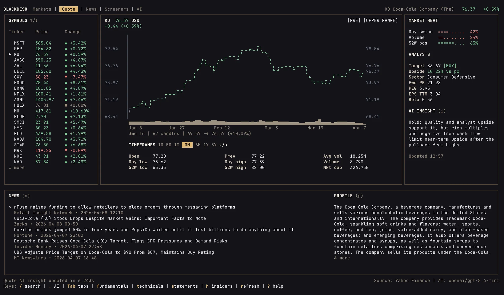

# Blackdesk

<p align="center">
  
</p>

<p align="center">
  <strong>The open source market research terminal</strong>
</p>

<p align="center">
  Quotes, charts, technicals, news, fundamentals, statements, insiders, screeners, and local AI connectors in one keyboard-first desk.
</p>

<p align="center">
  <a href="LICENSE"></a>
  
  
</p>

<p align="center">
  
</p>

> Blackdesk is under active development. Features, workflows, install channels, and packaging may still change as the public release is finalized.

Blackdesk is a local-first, keyboard-first market research desk.
It keeps symbol research, market-wide news, screeners, and local AI workflows in one focused terminal surface instead of spreading them across generic dashboards and browser tabs.

## Install

```bash
curl -fsSL https://blackdesk.ai/install | bash
```

Upgrade an installed binary:

```bash
blackdesk upgrade --check
blackdesk upgrade
```

CLI:

```bash
blackdesk -h
blackdesk --help
blackdesk ?
blackdesk -v
blackdesk --version
blackdesk upgrade --check
blackdesk upgrade
```

Local equivalent:

```bash
./scripts/install.sh
```

Optional installer overrides:

- `BLACKDESK_INSTALL_DIR="$HOME/bin"`
- `BLACKDESK_VERSION=0.1.0`
- `BLACKDESK_REPO=Blackdesk-ai/blackdesk`

## Product Surfaces

- `Quote`: active symbol workflow for charts, technicals, news, statements, insiders, and AI context
- `Markets`: watchlists, movers, and broad tape context before drilling into a symbol
- `News`: a dedicated normalized headline wire
- `Screeners`: discovery flows for finding setups and movers
- `AI`: local connectors targeted with desk-aware market context

The bottom status bar shows the active market-data source, AI model, and app version.
When a newer published release is available, the version segment changes to `vCurrent -> vLatest`.

## Why Blackdesk

- local-first workflow
- keyboard-first interaction model
- one desk for symbol work, market context, and AI assistance
- explicit boundaries between quote research, news, screeners, and AI
- replaceable provider and connector architecture behind the product surface

## Market Data And Usage Notice

Blackdesk is a research tool, not a brokerage platform or execution system.

- it is provided for research and workflow assistance only
- it does not provide investment, legal, tax, or financial advice
- market data may be delayed, incomplete, unavailable, or changed by upstream providers
- always verify critical prices, filings, news, and corporate actions with authoritative sources before making trading or investment decisions

## Documentation

- user guide: `docs/USER_GUIDE.md`
- keyboard shortcuts: `docs/KEYBOARD_SHORTCUTS.md`
- FAQ: `docs/FAQ.md`
- product distribution and release channels: `docs/DISTRIBUTION.md`
- architecture overview: `docs/ARCHITECTURE.md`
- release checklist: `docs/PUBLISHING.md`
- contributing guide: `CONTRIBUTING.md`
- security policy: `SECURITY.md`
- community standards: `CODE_OF_CONDUCT.md`

## License

This project is licensed under the Apache License 2.0.
